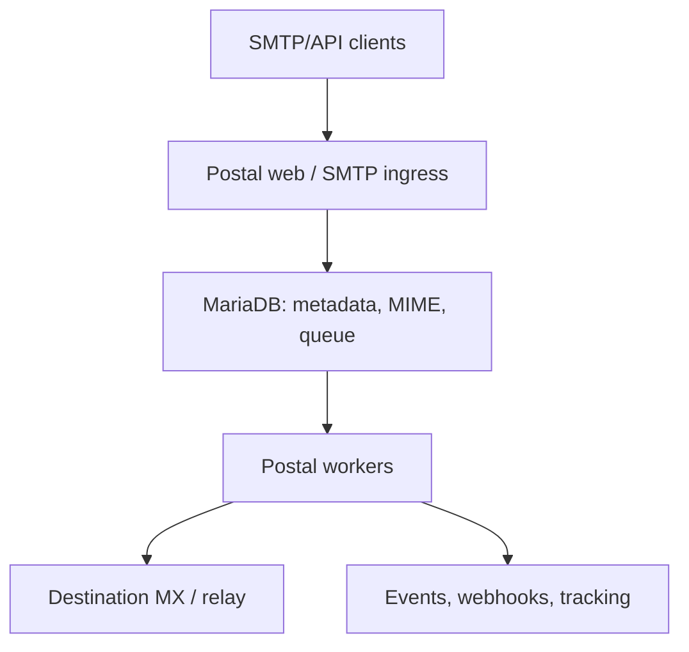

# Postal Performance Optimization Guide

## Назначение документа

Этот документ фиксирует исходные требования, подтверждённые особенности Postal, правила нагрузочного тестирования и рекомендуемую последовательность оптимизации. Его следует поддерживать вместе с кодом и обновлять после каждого подтверждённого измерения или архитектурного решения.

Документ не является обещанием конкретной производительности. Любое утверждение о bottleneck или приросте должно подтверждаться воспроизводимым тестом.

## Главные инженерные правила

1. Считать нагрузку в **получателях**, а не только в SMTP-сессиях, API-запросах или письмах кампании.
2. Не оптимизировать по предположениям: сначала воспроизвести baseline, затем профилировать.
3. Менять за один эксперимент одну существенную переменную.
4. Сравнивать сборки на одинаковых CPU/RAM limits, данных и конфигурации.
5. Не считать скорость локального SMTP sink скоростью реальной интернет-доставки.
6. Любая оптимизация должна сохранять учёт состояний, retries, bounces и причины ошибок.
7. Производительность без корректности, backpressure и управляемого rollback не считается результатом.
8. Сначала сохранять совместимость с существующим форком Postal; компоненты заменять постепенно.
9. Не переносить Ruby-код на другой язык целиком без доказательства, что именно этот контур ограничивает производительность.
10. Измерять не только throughput, но и стоимость обработки одного миллиона получателей.

## Известные требования заказчика

Следующие пункты получены из переписки и пока считаются требованиями или исходными данными заказчика, а не результатами независимого измерения:

- Система используется для массовых промо-кампаний клиентов.
- Полноценная multi-tenant-модель для нового data plane не требуется.
- Нужно хранить состояние каждого получателя: отправлен, не отправлен, отложен, окончательно отклонён и причина.
- IP mapping, IP pools/rotation и создание SMTP servers являются критически важными функциями.
- Существующий продукт — модифицированный форк Postal с дополнительными функциями.
- Текущая архитектура преимущественно масштабируется вертикально.
- Главной предполагаемой проблемой заказчик называет скорость Ruby workers; роль MariaDB пока не доказана.
- Требуется минимум 5 млн отправлений в сутки и возможность дальнейшего роста.
- Go запрещён заказчиком. Для новых компонентов допустимы Ruby, Rust или C++.
- Желательно сохранить существующий Postal и заменять bottleneck-компоненты поверх него.
- Инфраструктурная стоимость должна стать отдельным KPI оптимизации.

## Противоречия и неизвестные данные

До фиксации production SLO необходимо разрешить следующие вопросы:

- В переписке встречаются разные текущие пределы: «несколько миллионов, но меньше 5 млн» и «не больше 1 млн за 24 часа».
- Не определено, являются ли эти числа сообщениями, уникальными MIME-объектами или получателями.
- Неизвестна продолжительность окна отправки. Пять миллионов за сутки и за два часа — разные задачи.
- Неизвестно, где измерен предел: приём Postal, рост очереди, попытки соединения или подтверждённые ответы удалённых MX.
- Неизвестны текущая топология, параметры MariaDB, число workers, sending IP и фактический месячный расход.
- Неизвестен diff клиентского форка относительно upstream Postal.
- Предыдущая реализация на Go достигала 5 млн, но была отклонена из-за других проблем. До новой реализации нужен её код или postmortem.
- Не определены feature mix, retention и объём хранимой истории.

Не начинать крупную замену worker до получения хотя бы частичных ответов на эти вопросы.

## Масштаб целевой нагрузки

Пять миллионов получателей соответствуют следующей минимальной средней скорости:

| Окно отправки |   Средняя скорость |
| ------------: | -----------------: |
|       24 часа |    58 recipients/s |
|       8 часов |   174 recipients/s |
|        4 часа |   347 recipients/s |
|        2 часа |   694 recipients/s |
|         1 час | 1 389 recipients/s |

Это только среднее арифметическое. Реальная система должна выдерживать согласованный burst, retries и backlog drain. Проектный target нельзя выводить только из `5M / 24h`.

При среднем MIME 100 KB пять миллионов отдельных копий означают около 500 GB raw data в сутки до учёта индексов, deliveries, репликации и резервных копий. Retention и модель хранения MIME влияют на архитектуру не меньше CPU.

## Upstream Postal: подтверждённая структура

Для Postal 3.x runtime состоит из трёх основных процессов:

- `postal web-server` — Web UI и HTTP API;
- `postal smtp-server` — SMTP ingress;
- `postal worker` — фоновые задачи и доставка.

Команды `cron` и `requeuer`, а также зависимость от RabbitMQ были удалены в Postal 3.0. Очередь и координация фоновой обработки находятся в MariaDB.



Postal позволяет запускать несколько web, SMTP и worker-инстансов. Однако они используют общие main/message databases, поэтому добавление процессов не гарантирует линейного масштабирования.

## Подтверждённые точки возможного bottleneck

### 1. Синхронный путь SMTP acceptance

SMTP server сохраняет каждое сообщение и ставит его в очередь до ответа `250 OK`. Скорость и latency MariaDB непосредственно влияют на приём SMTP.

Следствия:

- ingress benchmark должен отдельно измерять latency до `250`;
- увеличение SMTP replicas может помочь только до насыщения общей DB;
- большие сообщения и медленное хранилище могут задерживать другие операции;
- перед изменением ingress необходимо измерить CPU, allocation rate, DB latency и размер `DATA` в памяти.

### 2. Отдельное сообщение на каждого получателя

HTTP/SMTP path создаёт отдельный message для каждого recipient. При сохранении каждого message отдельно сохраняются raw headers/body, metadata, statistics и queue entry.

Следствия:

- одно письмо на 50 получателей нельзя считать одной единицей нагрузки;
- raw MIME может многократно дублироваться;
- оптимальная будущая модель — один immutable MIME object и отдельные recipient envelopes;
- миграция этой модели затрагивает UI, tracking, retention и поиск, поэтому должна выполняться через совместимый adapter.

### 3. DB-backed queue

Worker ищет сообщения по `ip_address_id`, lock-полям и `retry_after`, блокирует запись через `UPDATE ... LIMIT 1`, а затем может добавить до 100 сообщений с тем же `batch_key`.

В upstream schema таблица `queued_messages` имеет отдельные индексы только на:

- `domain`;
- `message_id`;
- `server_id`.

При этом hot queries используют также:

- `ip_address_id`;
- `locked_by`;
- `locked_at`;
- `retry_after`;
- `batch_key`.

Это является гипотезой о неэффективном плане запроса, но не разрешением сразу добавить случайный индекс. Сначала обязательны реальные `EXPLAIN/ANALYZE`, slow query log, lock waits и тесты на production-like размере очереди. В клиентском форке индексы уже могли быть изменены.

### 4. Горячие статистические записи

При создании message обновляются message statistics и глобальные totals. При высокой конкуренции такие счётчики могут создавать row-lock contention и дополнительный write amplification.

Кандидат на изменение: записывать immutable delivery events, а агрегаты считать асинхронно и идемпотентно. Нельзя просто удалить статистику, если UI или отчёты клиента зависят от неё.

### 5. Sending IP привязан к worker host

Worker получает список IP локальных интерфейсов ОС и выбирает сообщения без конкретного IP либо с `ip_address_id`, присутствующим на текущем host.

Следствия:

- scheduler обязан знать, на каком узле реально доступен sending IP;
- неправильное размещение worker оставляет часть очереди без исполнителя;
- containers могут требовать host networking или явного назначения адресов;
- failover sending IP должен включать сетевое перемещение IP, маршрутизацию и обновление scheduler state;
- IP rotation нельзя реализовывать как случайный выбор адреса без учёта репутации и throttling.

### 6. Конфигурация DB и workers

Upstream поддерживает отдельные `main_db` и `message_db`. По умолчанию worker использует два потока, а main DB pool имеет небольшой default. Эти значения являются исходной точкой, а не рекомендацией для production.

Рост worker threads необходимо сопоставлять с:

- размером DB pool;
- числом DB connections;
- row locks;
- CPU Ruby processes;
- concurrency удалённых SMTP-соединений;
- памятью на in-flight MIME.

Не запускать тысячи worker threads только потому, что сервер имеет много CPU.

## Сначала изучить клиентский форк

Перед первой оптимизацией сохранить следующие артефакты:

1. Точный upstream base commit.
2. Полный diff форка.
3. Список изменённых DB migrations и индексов.
4. Изменения queue claiming, batching, retries и statistics.
5. Реализацию IP mapping и создания SMTP servers.
6. Custom features и их использование в production.
7. Текущие Docker images, конфигурацию и параметры запуска.
8. Существующие метрики, dashboards и инциденты.
9. Код и postmortem предыдущего Go-прототипа.

Особое внимание уделить изменениям, которые могли нарушить batching, connection reuse или локальность sending IP. Нельзя считать upstream Postal точным отражением production-форка клиента.

## Термины и единицы измерения

Во всех отчётах явно указывать:

- `messages` — уникальные логические письма/MIME;
- `recipients` — отдельные адресаты и delivery state;
- `accepted` — Postal ответил SMTP `250` или успешным HTTP response;
- `attempted` — worker начал SMTP delivery attempt;
- `delivered` — следующий SMTP server ответил успешным кодом;
- `deferred` — временная ошибка, ожидается retry;
- `failed` — окончательная ошибка;
- `inbox placement` — письмо реально попало во входящие, что не эквивалентно SMTP `250`.

Главная throughput-метрика data plane — `recipients/s`.

## Обязательные показатели benchmark

### Производительность

- максимальный устойчивый accepted recipients/s;
- максимальный устойчивый delivered-to-sink recipients/s;
- p50/p95/p99 latency до SMTP `250` или HTTP response;
- p50/p95/p99 queue latency;
- backlog growth rate;
- время drain после burst;
- delivery attempts/s и retry rate.

### Эффективность

- CPU-seconds на 1 млн recipients;
- RAM high-water mark;
- DB queries и DB time на recipient;
- DB rows written на recipient;
- disk bytes/IOPS на recipient;
- network bytes на recipient;
- стоимость инфраструктуры на 1 млн recipients.

### Корректность

- lost messages;
- unexpected duplicates;
- invalid state transitions;
- несоответствие accepted/delivered/failed/queued;
- неправильный sending IP;
- потерянные или повторные webhooks;
- некорректные retry intervals.

Базовый reconciliation-инвариант после полного drain:

```text
accepted_recipients = delivered + terminal_failed + suppressed + cancelled
```

Во время выполнения теста:

```text
accepted_recipients = delivered + terminal_failed + suppressed + cancelled + queued + in_flight
```

Все исключения должны быть объяснены и отражены в отчёте.

## Правильный тестовый контур

Инфраструктура описана отдельно в `postal-benchmark-ansible-task.md`. Основные правила:

- генератор нагрузки размещать отдельно от SUT для финальных измерений;
- использовать настоящий Postfix с очередью и `discard` transport для happy path;
- поднимать несколько Postfix только после доказательства, что один стал bottleneck;
- перед каждым Postal test выполнять direct calibration генератора и Postfix;
- capacity вспомогательной цепочки должна быть минимум в два раза выше Postal;
- использовать собственный DNS и домены `.test`;
- запретить исходящий TCP/25 ко всем адресам, кроме test sinks;
- сохранять image digest, commit SHA, inventory, resource limits и seed workload вместе с результатом.

Postfix с discard проверяет реальный SMTP handshake и queue acceptance, но не моделирует поведение интернета. Для retries нужен дополнительный fault-injection SMTP endpoint с профилями:

- success `250`;
- temporary `421/450/451`;
- permanent `550/551/553`;
- медленный banner/DATA response;
- connection reset и timeout;
- TLS success/failure;
- неоднозначный disconnect после принятия DATA.

## Протокол сравнения сборок

Для каждого кандидата:

1. Восстановить одинаковое состояние БД и очереди.
2. Проверить healthchecks.
3. Выполнить direct sink calibration.
4. Выполнить 3 минуты warm-up.
5. Выполнить минимум 10–15 минут steady load.
6. Остановить ingress и измерить drain.
7. Выполнить reconciliation.
8. Повторить тест не менее пяти раз.
9. Использовать медиану и показывать разброс.
10. Выполнять серии `baseline → candidate → baseline`, чтобы обнаруживать drift хоста.

Формула throughput improvement:

```text
improvement_percent = (candidate_throughput / baseline_throughput - 1) * 100
```

Формула эффективности масштабирования:

```text
scaling_efficiency(N) = throughput(N) / (N * throughput(1)) * 100
```

Строить две независимые кривые:

- одинаковые ресурсы, разные сборки — эффективность кода;
- 1/2/4/8 workers или resource units — потенциал масштабирования.

На shared VPS не объявлять малый прирост победой, если он сопоставим с межзапусковым разбросом.

Слабое фиксированное железо подходит для сравнения относительного прироста. Финальные выводы о горизонтальном масштабировании необходимо повторить на нескольких изолированных узлах с гарантированными CPU и зафиксированной сетью.

## Матрица workload

Минимальная матрица должна включать:

- MIME: 10 KB, 100 KB, 1 MB; 10 MB только коротким тестом;
- recipients/message: 1, 10 и 50;
- destination distribution: один домен, несколько крупных доменов, тысячи доменов;
- SMTP response: быстрый success, медленный success, temporary fail, permanent fail;
- tracking: off/on;
- DKIM: off/on;
- webhooks: off/on и медленный endpoint;
- spam/virus inspection: согласно production feature mix;
- burst, steady state и recovery;
- пустая, средняя и большая очередь.

Основной benchmark-профиль должен быть зафиксирован и не меняться между commits. Дополнительные профили не должны подменять основной.

## Инструменты диагностики

### Ruby/Postal

- CPU flamegraph и sampling profiler;
- allocation/GC statistics;
- RSS по процессам;
- время выполнения worker jobs;
- latency SMTP commands;
- количество активных SMTP connections;
- существующие Prometheus metrics Postal.

### MariaDB

- slow query log и `performance_schema`;
- `EXPLAIN` для queue claim, batching и message lookup;
- query latency и rows examined;
- row lock waits/deadlocks;
- buffer pool hit rate;
- redo/flush rate;
- active connections и pool wait;
- disk latency, IOPS и fsync;
- размер таблиц и индексов.

### ОС и сеть

- CPU utilization и steal time;
- context switches;
- memory pressure/page faults;
- disk latency/queue depth;
- TCP connections, retransmits и ephemeral ports;
- DNS latency/cache hit;
- network throughput по узлам.

## Последовательность оптимизации

### Этап 0. Воспроизводимый baseline

- Развернуть upstream и клиентский fork на одинаковом стенде.
- Воспроизвести reported limit.
- Разделить ingress throughput и queue drain throughput.
- Найти первый насыщенный ресурс.
- Зафиксировать baseline report в репозитории/CI artifacts.

Переходить дальше только если тест повторяется с приемлемым разбросом.

### Этап 1. Низкорисковые изменения существующего Postal

Проверять по одному:

- планы запросов и обоснованные composite indexes;
- DB pool и worker thread balance;
- число Ruby worker processes;
- MariaDB buffer pool, redo log и NVMe latency;
- разделение main DB и message DB;
- batching по destination domain;
- устранение сетевых/DNS/IPv6 timeouts;
- отключение действительно неиспользуемых feature paths;
- уменьшение синхронной статистики без потери данных.

Не ожидать, что простой индекс обязательно даст десятикратный прирост: клиент мог уже выполнить базовые оптимизации.

### Этап 2. Уменьшение DB write amplification

Кандидаты:

- append-only delivery events вместо синхронного обновления агрегатов;
- асинхронные counters и analytics;
- bulk writes;
- отдельная очередь webhooks;
- более эффективный queue claim;
- partitioning/retention таблиц;
- исключение повторного parsing MIME.

Каждое изменение должно иметь migration, rollback и reconciliation job.

### Этап 3. Rust outbound worker как первый заменяемый компонент

Предпочтительный первый Rust PoC — не полный аналог Postal, а совместимый outbound delivery worker.

Он должен реализовать:

- получение задания через versioned adapter;
- recipient state machine;
- DNS/MX resolution и cache;
- SMTP/TLS delivery;
- connection reuse по destination;
- per-domain и per-IP concurrency/rate limits;
- retry scheduling с jitter;
- выбор sending IP и HELO identity;
- запись delivery result и диагностической причины;
- idempotency и attempt IDs;
- метрики, structured logs и graceful shutdown;
- backpressure при проблемах DB/queue/MX.

Сначала запускать его в shadow/read-only режиме либо направлять небольшой изолированный shard. Ruby worker должен оставаться доступным для rollback.

### Этап 4. Новая модель MIME storage

Целевая модель:

```text
MessageContent (один immutable MIME blob)
    ├── RecipientEnvelope A
    ├── RecipientEnvelope B
    └── RecipientEnvelope C
```

Требования:

- streaming upload вместо полного буфера в памяти;
- content ID и контроль целостности;
- один MIME blob на логическое письмо;
- отдельные recipient/delivery states;
- retention и безопасная сборка мусора;
- поддержка DKIM/tracking transformations;
- совместимость UI/API через adapter;
- возможность object storage только после измерения latency и стоимости.

### Этап 5. Вынос durable queue и retry scheduler

Не добавлять Kafka, NATS, RabbitMQ или другую систему только ради слова «масштабирование». Решение принимается после подтверждения, что MariaDB queue остаётся bottleneck после более дешёвых изменений.

Новая очередь должна обеспечивать:

- durable at-least-once processing;
- partition key по destination domain и/или sending IP;
- отложенные retries;
- visibility timeout/lease recovery;
- controlled redelivery;
- backpressure и quotas;
- replay/audit;
- независимые очереди delivery, inbound и webhooks.

### Этап 6. Stateless ingress и горизонтальное масштабирование

После отделения MIME storage и durable queue SMTP/API ingress может стать stateless:

- streaming write;
- admission control;
- idempotency key для HTTP API;
- bounded concurrency;
- быстрый durable acknowledgement;
- независимое масштабирование web и SMTP ingress.

## Выбор языка

### Rust — основной выбор для нового data plane

Преимущества относительно C++:

- близкая к C++ производительность без garbage collector;
- memory safety без ручного управления временем жизни памяти;
- защита от значительной части data races на уровне типов;
- сильная модель ownership для in-flight message state;
- современный async I/O ecosystem;
- удобные статические бинарники и контейнеризация;
- pattern matching и строгие enum для SMTP/delivery state machine;
- встроенная культура тестирования, fuzzing и безопасного dependency management;
- обычно меньшая стоимость многолетней поддержки сетевого сервиса, чем у нового C++ кода;
- полезность технологии для дальнейшего рынка труда.

Риски Rust:

- learning curve и более медленная первая реализация;
- долгие compile times;
- email/SMTP libraries необходимо оценить прототипом;
- нельзя компенсировать недостаток архитектуры только выбором языка.

### C++

Использовать, если конкретная зрелая библиотека или существующий код дают измеримое преимущество. Для нового асинхронного SMTP worker Rust предпочтительнее из-за безопасности и сопровождаемости.

### Ruby и TypeScript

- Ruby оставить для существующего control plane, UI и compatibility logic, пока они не доказаны bottleneck.
- TypeScript подходит для CI orchestration, benchmark controller, reports и внутренних API.
- TypeScript не является предпочтительным языком для самого горячего delivery loop.
- Go не использовать из-за явного ограничения заказчика, но обязательно изучить причины отказа предыдущего Go-прототипа.

## IP mapping и создание SMTP servers

До изменения workers документировать текущую цепочку:

```text
campaign/client/domain
  → sending pool
  → sending IP
  → worker host/network interface
  → HELO hostname + PTR/rDNS
  → DKIM domain + return path
  → destination-domain throttling
```

Нужно определить:

- является ли mapping статическим, случайным, weighted или reputation-aware;
- как IP закрепляются за серверами и контейнерами;
- как создаются и удаляются SMTP server configurations;
- что происходит при недоступности worker host;
- можно ли безопасно перераспределить очередь на другой IP;
- как учитываются warming, complaint rate, bounce rate и provider limits;
- где хранятся quotas и состояние throttling;
- как обеспечивается согласованность при нескольких scheduler replicas.

IP rotation сама по себе не повышает deliverability. Слишком агрессивная смена IP может ухудшить репутацию и привести к блокировкам.

## Delivery state и гарантии

Рекомендуемая state machine:

```text
accepted → queued → leased → attempting
                         ├── delivered
                         ├── deferred → queued
                         └── terminal_failed
```

SMTP не позволяет гарантировать exactly-once во всех сетевых сбоях. Например, соединение может оборваться после того, как удалённый сервер принял письмо, но до фиксации ответа отправителем.

Поэтому необходимы:

- at-least-once semantics;
- уникальный message/recipient ID;
- уникальный attempt ID;
- идемпотентные внутренние события и webhooks;
- детектор неожиданных duplicates;
- audit trail всех переходов;
- lease recovery после падения worker;
- ограниченное число retries и dead-letter/terminal state.

## Deliverability отдельно от throughput

Локальный Postfix показывает техническую пропускную способность, но production delivery зависит от:

- latency и throttling Gmail/Microsoft/Yahoo/корпоративных MX;
- IP/domain reputation и warming;
- PTR/rDNS, SPF, DKIM и DMARC;
- complaint/bounce suppression;
- per-domain connection и message limits;
- DNS failures и IPv4/IPv6 routing;
- размера сообщений;
- retries и greylisting.

Outbound MX delivery обычно использует TCP/25. Порты 465/587/2525 относятся преимущественно к submission или relay и не заменяют доступ к destination MX:25. Ограничения провайдера должны быть проверены до production deployment.

## Несколько независимых Postal-инсталляций

Несколько полностью изолированных Postal installations с отдельными DB действительно могут дать почти линейный прирост, если workload можно статически разделить. Этот вариант следует сохранить как fallback и контрольный эксперимент.

Потенциальные ключи шардирования:

- campaign;
- client/account;
- sending domain;
- IP pool;
- destination-domain partitions.

Ограничения подхода:

- нужен глобальный router;
- усложняются failover и rebalance;
- suppressions/unsubscribes могут требовать общей консистентности;
- статистика, поиск, webhooks и аудит становятся распределёнными;
- возможны duplicates при переносе shard;
- часть мощностей простаивает из-за неравномерных кампаний;
- обновление модифицированного форка выполняется на каждом shard;
- IP pools и worker placement всё равно требуют централизованного управления.

Для текущего campaign-only use case этот вариант может оказаться дешевле полного rewrite. Его следует сравнить по стоимости и операционной сложности с Rust data plane.

## Архитектурные принципы целевого решения

- Разделять control plane Postal и высоконагруженный data plane.
- Делать ingress stateless после durable сохранения.
- Хранить MIME один раз, состояние — на recipient.
- Разделять delivery queue, retry scheduler, inbound и webhooks.
- Partitioning строить вокруг destination domain и sending IP.
- Переиспользовать SMTP connections там, где это допускает принимающая сторона.
- Применять per-domain/per-IP backpressure.
- Считать статистику асинхронно из событий.
- Не использовать глобальные горячие counters в transaction path.
- Иметь versioned contracts между Postal и новыми компонентами.
- Поддерживать canary, feature flags и быстрый rollback.
- Проектировать операции идемпотентными.
- Не хранить бесконечную историю без retention policy.

## Безопасность и эксплуатационные ограничения

- DKIM keys, SMTP credentials и DB passwords хранить вне Git-репозитория.
- Не записывать raw MIME, адреса и credentials в обычные application logs.
- Разделить DB-пользователей control plane, delivery workers и analytics по минимально необходимым правам.
- Подписывать/фиксировать Docker images по digest и сохранять provenance сборки.
- Ограничивать outbound network destinations каждого компонента.
- Тестовый контур должен физически или правилами firewall исключать отправку реальным MX.
- Любой debug/trace режим должен иметь ограниченный срок и объём хранения.
- Backup/restore и disaster recovery проверять отдельно от performance benchmark.

## Стратегия безопасного внедрения

1. **Observe:** добавить метрики без изменения поведения.
2. **Shadow:** новый компонент читает копию заданий, но не отправляет.
3. **Synthetic shard:** отправка только на внутренний Postfix.
4. **Canary:** малый production shard с отдельным IP/domain.
5. **Compare:** reconciliation старого и нового paths.
6. **Ramp:** 1% → 5% → 20% → 50% → 100% при выполнении SLO.
7. **Rollback:** возможность немедленно вернуть shard Ruby workers.

Нельзя одновременно менять queue, storage, SMTP worker и schema: при деградации невозможно будет локализовать причину.

## Cost model

Для каждой сборки считать:

```text
cost_per_million =
  compute + database + storage + traffic + observability + operational overhead
```

Минимальные показатели отчёта:

- recipients/core-hour;
- recipients/GB RAM-hour;
- DB I/O per million;
- stored GB per million;
- outbound GB per million;
- infrastructure cost per million;
- engineer/operations complexity как качественная оценка.

Оптимизация считается полезной, если она повышает throughput, снижает unit cost или улучшает latency/reliability без неприемлемого роста сложности.

## Что не следует делать

- Начинать с полного rewrite Postal.
- Переписывать Web UI/admin panel ради скорости delivery.
- Считать один API request одним письмом независимо от recipients.
- Использовать только success-only SMTP sink.
- Тестировать на реальных внешних адресатах.
- Сравнивать сборки на разных типах серверов.
- Выбирать лучший единичный run вместо медианы.
- Увеличивать workers без наблюдения за DB locks и pool.
- Добавлять индексы без проверки write cost и query plan.
- Добавлять distributed queue до доказательства необходимости.
- Терять историю delivery attempts ради throughput.
- Делать случайную IP rotation без reputation model.
- Объявлять `250 Accepted` попаданием в inbox.

## Обязательные вопросы заказчику

### Нагрузка и SLO

- 5 млн — messages или recipients?
- За какое окно нужно отправить этот объём?
- Каковы average, p95 и peak на интервалах 1 секунда, 1 минута и 5 минут?
- Какой допустимый backlog и drain time?
- Каковы p95/p99 acceptance и delivery latency?
- Каковы средний/p95/p99 MIME size и recipients/message?

### Текущая система

- Можно ли получить форк, commit SHA и diff относительно upstream?
- Какая точная схема серверов, DB, workers и IP pools?
- Какие запросы/процессы saturate CPU, DB, disk или network?
- Каковы queue length, queue latency, retry/bounce rate?
- Какие оптимизации уже были сделаны?
- Что означает текущий предел 1 млн и где он измерен?

### Предыдущий Go-прототип

- Где находится код?
- Как был подтверждён результат 5 млн?
- Какие именно проблемы привели к отказу?
- Были ли потери, duplicates, проблемы с tracking, IP mapping, retries или deliverability?
- Можно ли повторить его benchmark на новом стенде?

### Функции

- Какие custom features реально используются?
- Нужны ли inbound routes, spam/virus scanning, tracking и webhooks?
- Как устроены global suppressions/unsubscribes?
- Какой retention нужен для MIME, events и logs?
- Как должен работать поиск истории?

### IP и SMTP

- Сколько sending IP и на каких узлах они находятся?
- Как работает mapping campaign/domain → IP pool?
- Как создаются SMTP servers и credentials?
- Какие правила warming, quotas и failover?
- Какие cloud/hosting providers разрешают необходимый outbound TCP/25?

## Definition of Done для каждой оптимизации

Изменение можно принять только если:

- есть benchmark до и после;
- ресурсы и workload идентичны;
- результат повторён минимум пять раз;
- приведён процент прироста и разброс;
- очередь не растёт на steady load;
- reconciliation не обнаружил потерь;
- duplicates не превышают согласованный предел;
- retries, bounces, tracking и webhooks сохранили контракт;
- показан новый bottleneck;
- есть migration и rollback plan;
- обновлены этот документ, ADR и benchmark report.

## Рекомендуемая структура ADR

Для каждого существенного решения создавать отдельный Architecture Decision Record:

```markdown
# ADR-NNN: Название решения

## Context

Какой измеренный bottleneck устраняется.

## Baseline

Commit, image digest, workload, ресурсы и результаты.

## Decision

Какое изменение принято.

## Alternatives

Какие варианты рассматривались и почему отклонены.

## Consequences

Производительность, корректность, стоимость, migration и rollback.

## Verification

Ссылки на benchmark artifacts и reconciliation report.
```

## Исходные точки в upstream Postal

Ссылки ниже указывают на `main` для удобства навигации. В benchmark report необходимо записывать точный commit SHA и по возможности заменять ссылки на pinned revision.

- Runtime commands: [`bin/postal`](https://github.com/postalserver/postal/blob/main/bin/postal)
- SMTP persistence before `250`: [`app/lib/smtp_server/client.rb`](https://github.com/postalserver/postal/blob/main/app/lib/smtp_server/client.rb)
- Per-recipient message creation: [`app/models/outgoing_message_prototype.rb`](https://github.com/postalserver/postal/blob/main/app/models/outgoing_message_prototype.rb)
- Raw MIME, statistics and queue writes: [`lib/postal/message_db/message.rb`](https://github.com/postalserver/postal/blob/main/lib/postal/message_db/message.rb)
- Queue schema/indexes: [`db/schema.rb`](https://github.com/postalserver/postal/blob/main/db/schema.rb)
- Queue locking and local sending IP discovery: [`app/lib/worker/jobs/process_queued_messages_job.rb`](https://github.com/postalserver/postal/blob/main/app/lib/worker/jobs/process_queued_messages_job.rb)
- Destination batching: [`app/models/queued_message.rb`](https://github.com/postalserver/postal/blob/main/app/models/queued_message.rb)
- Worker queue-latency metric: [`app/lib/worker/process.rb`](https://github.com/postalserver/postal/blob/main/app/lib/worker/process.rb)
- Main/message DB and worker configuration: [`doc/config/yaml.yml`](https://github.com/postalserver/postal/blob/main/doc/config/yaml.yml)
- Postal 3 changes: [`CHANGELOG.md`](https://github.com/postalserver/postal/blob/main/CHANGELOG.md)

## Рабочий план проекта

1. Развернуть воспроизводимый тестовый контур.
2. Автоматизировать его deployment через Ansible inventory.
3. Измерить upstream Postal и клиентский fork.
4. Создать fork и CI/CD для автоматического benchmark каждого кандидата.
5. Выполнять малые подтверждённые оптимизации существующего кода.
6. Реализовать совместимый worker с оптимизациями PoC для первого доказанного bottleneck.
7. Постепенно заменять queue/storage/ingress только при наличии измерений и безопасной migration path.
