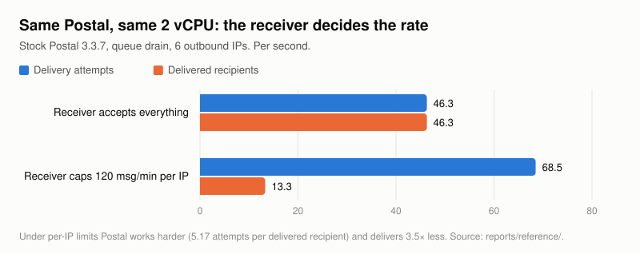

# Postal benchmark results: throughput, IP pools and receiver limits

A summary of the findings this bench has produced so far, and — just as importantly — of what
it has not established yet. The methodology is in [ARCHITECTURE.md](ARCHITECTURE.md), the
Postal internals the conclusions rest on are in
[docs/postal-internals.md](docs/postal-internals.md), and the full narrative with every wrong
turn is in [docs/engineering-log.md](docs/engineering-log.md). Practical advice drawn from these
results is in the [tuning checklist](docs/postal-tuning-checklist.md) and the
[FAQ](docs/postal-performance-faq.md).

Reference runs are in [reports/reference/](reports/reference/). Every run in this project
carries its own "what this run does not prove" section; the claims below inherit those limits.

## The short version

Postal's own throughput is not what stands between a modest server and 5 million recipients
per day. On a 2 vCPU virtual machine the stock 3.3.7 image delivered **46–51 recipients per
second**, which is 4.0–4.4 million per day, with the reconciliation identity closing exactly.

What does bind, and what the bench was extended to measure, is the receiving side. Under
per-IP limits the same Postal, on the same hardware, working *harder*, delivered a quarter as
much. Throughput then scales with the number of sending addresses, not with cores.

## Postal throughput with and without per-IP receiver limits

Identical in everything but the receiver's policy: 6 outbound addresses, 75 ms artificial
response delay on the sink, 2 worker replicas × 2 threads, 1000 destination domains,
100 KB MIME, one recipient per message.

| | Baseline | Per-IP limits |
|---|---|---|
| Receiver policy | accepts everything | 120 messages/min per address |
| Queue at start | 14 455 | 24 557 |
| Delivery attempts per second | 46.3 | 68.5 |
| **Delivered, recipients/s** | **46.3** | **13.3** |
| Attempts per delivered recipient | 1.00 | 5.17 |
| Refusals recorded by the receiver | 0 | 16 900 |
| Reconciliation discrepancy | 0 % | 0 % |

<picture>
  <source media="(prefers-color-scheme: dark)" srcset="docs/images/postal-throughput-receiver-limits-dark.svg">
  
</picture>

The attempt rate *rose* under the cap, because a temporary refusal arrives at `MAIL FROM` and
the message body is never transferred, so the worker cycles faster. Five of every six dequeue
cycles bought nothing. None of this is visible in a delivery-rate figure, which counts only
what arrived — which is why the bench reports both.

Which limit bound is worth checking before any of these numbers are used: 16 921 of the
refusals were the volume cap and 8 were the concurrency cap. A concurrency cap alone does not
bind at this delivery concurrency, and the two are indistinguishable in the SMTP reply — both
answer `421 ... too many connections` — so the bench classifies them from the receiver's log
instead.

## What tracking, webhooks and `send_limit` cost

The two runs above were made with `send_limit` cleared and with tracking and webhooks off.
The bench now runs all three the way production does, and the same two arms were measured
again on that configuration. Reports:
[reports/reference/](reports/reference/), the `-production-features` pair.

| | Receiver accepts everything | Per-IP limits |
|---|---|---|
| Queue at start | 14 865 | 24 880 |
| Delivery attempts per second | 8.7 | 16.9 |
| **Delivered, recipients/s** | **8.6** | **2.0** |
| Attempts per delivered recipient | 1.00 | 8.24 |
| Refusals recorded by the receiver | 0 | 4549 |
| Reconciliation discrepancy | 0.08 % | 0 % |

Against 46.3 and 13.3 on the same hardware, that is a **fivefold to sixfold** drop, and it is
not explained by anything Postal was asked to do differently on the wire: with an accepting
receiver the retry amplification is still exactly 1.00, so no work was wasted on refusals.
Each delivery simply became more expensive.

Three things changed together and the runs do not separate them: tracking rewrites every link
and writes rows to `links`, webhooks add an HTTP round trip per delivery **from the same
worker process** that sends the mail, and a set `send_limit` restores the per-delivery
`UPDATE servers`. Two further differences run the other way — these runs used our build rather
than the upstream image, and had IP pools disabled where the earlier pair used six addresses,
which this project measured as *faster*, not slower. Attributing the cost to one feature needs
a run per feature and is in [roadmap.md](roadmap.md).

What survives the change is the capacity arithmetic. Under the same modelled limits each
address delivered 2.08 recipients/s against an allowance of 2.0, giving **about 28 sending
addresses** for the target rate — against 29 before, at a sixth of the absolute throughput.
That is the behaviour to expect from a figure that describes the receiver's policy rather than
the sender's speed.

**Single runs, no repeats**, and the accepting-receiver run did not empty its queue: 9331 of
14 865 rows in the 900 s allowed. The rate is what it sustained; the queue outlasted the
timeout.

## What this says about capacity planning

Under the modelled limits each address delivered 2.06 recipients/s against an allowance of
2.0, i.e. the addresses were at their quota. On that basis the target of 58 recipients/s
needs **about 29 sending addresses**.

That number is only as good as the limits behind it, and **those limits are an assumption**.
No destination-domain mix or observed production throttling has been supplied, so the profile
holds typical values for a large mailbox provider. Read the figure as the shape of the answer
— capacity is bought in addresses, not in cores — rather than as a procurement number. The
report refuses to print it at all unless the addresses actually reached their quota during the
run, because otherwise it would describe the sender's speed while reading as the receiver's
limit.

## Large IP pools defeat Postal batching

This is the finding with the most operational consequence, and it is what our work on the
code targets: an installation sending from a large pool of addresses is the case Postal
handles worst, and therefore the case with the most to gain.

`QueuedMessage` binds an outbound address to a message with `before_create :allocate_ip_address`
— at the moment the message is accepted, hours before it is sent, by weighted random choice
(`ORDER BY RAND() * priority DESC`). Batching then requires a match on **both** the recipient
domain and that address:

```ruby
self.class.ready.where(batch_key: batch_key, ip_address_id: ip_address_id, ...)
```

So a pool of N addresses divides the batch candidates by roughly N. Measured, same profile:

| Configuration | Rate | Connections per 3000 messages | Messages per session |
|---|---|---|---|
| One address | 50.0/s | 896 | 3.35 |
| Pool of 6 | 34.1/s | 2114 | 1.42 |

Six addresses made SMTP sessions 2.4× more numerous and cost a third of the throughput. Each
extra session pays again for the TCP handshake, EHLO, the MAIL/RCPT/DATA round trips and at
least three uncached DNS queries.

The arithmetic extrapolates: forming a batch of K messages needs roughly K × domains ×
addresses rows in the queue. At 1000 domains and a few hundred addresses, even a batch of two
requires a queue in the hundreds of thousands — in other words, batching stops happening at
all and every message becomes its own session.

A large pool is not optional: recipient providers cap volume per source address, so the
addresses are what buys the aggregate rate. The pool is a deliverability requirement, and the
cost above is a property of Postal's implementation rather than of the pool.

That is precisely where our changes apply. The larger the pool, the rarer it is for batch
collection to find a partner and the more work Postal does per message — so the bigger the
pool, the more there is to recover in the code. The first change is described in
[docs/optimisations.md](docs/optimisations.md); measuring it needs a bench arm with many
addresses, which the hardware available so far cannot provide.

## Which receiver limit binds: concurrency or volume

The four Postfix per-client limits are not independent, and choosing them carelessly measures
the wrong one. Postal reuses an SMTP session for only 1.4–3.35 messages, so a connection-rate
cap binds well below the message-rate cap unless it is set several times higher. `smtpd` also
answers `421 ... too many connections` for **both** the concurrency cap and the connection
rate cap, so the reply cannot distinguish them; the bench classifies refusals from the
receiver's log, which names the limit outright.

A concurrency cap alone was measured as unable to bind at this delivery concurrency: worker
threads spend much of their time in the database and the effective session count never
reached it. Volume limits bind at any concurrency, and they are what a provider actually
meters.

## Where Postal cannot help itself

Three properties come straight from the source and none of them is configurable:

- **No per-destination rate accounting exists.** Searching `app/` and `lib/` for throttling,
  rate limiting, token buckets or backpressure returns nothing. The only "limit" is
  `send_limit`, a per-server volume quota unrelated to destinations or addresses.
- **A refusal defers the message by five minutes**, from `(1.3 ** attempts) × 5.minutes` in
  `HasLocking#retry_later`, with the base period hardcoded. Receivers commonly meter volume
  over about a minute, so Postal empties a window's quota in a burst, is refused for the rest
  of it, and the refused work parks for five minutes instead of the seconds until the quota
  rolls over.
- **Three serialisation points live in the installation's shared database** and do not improve
  with more nodes: `Statistic.global.increment!` twice per message against a single row,
  `UPDATE servers SET send_limit_*` per delivery, and `UPDATE raw_message_sizes` per accepted
  message.

Together these are the argument for pacing output to the receiver's rate rather than raising
delivery concurrency, and for sharding an installation rather than distributing one.

## Delivery is at-least-once

On the throttled run the receiver accepted 4310 messages but only 4301 distinct recipients.
Nine recipients were delivered twice. That is not a deployment fault here — the worker
containers have distinct hostnames — but the ordinary consequence of an ambiguous outcome: the
receiver took the message and the acknowledgement did not get back, so Postal recorded a
failure and tried again. Postal carries no delivery-attempt identifier that would let a
receiver discard the second copy, so the more a receiver refuses, the more of this there is.

It is worth stating because it bounds what any throughput figure means: delivered counts are
upper bounds on distinct recipients reached, and the bench now reports both so the gap cannot
hide.

## What the bench does not establish

Stated plainly, because the numbers above are worth only as much as their limits:

- **Sustained throughput has never been measured.** Every result here is a drain run against a
  pre-filled queue. Ingress and delivery have not been run together at the target rate, and
  that combined figure is the only one that extrapolates to a full day.
- **Single runs, no repeats.** The spread between repeats of the same build is unknown, so a
  small difference between two runs cannot be read as a result.
- **The SMTP submission path is not exercised.** The generator uses the HTTP API. Postal's
  SMTP ingress, its authentication and the `credentials` table — which carries no indexes at
  all — never see load.
- **The sink is not a real MX.** No greylisting, no reputation effects, no connection
  failures, and every destination throttles identically where a real mix has tiers.
- **Queue lengths above roughly 25 000 rows are untested**, and both hot worker queries are
  uncovered by indexes.
- **The first pair of reference runs was made with `send_limit` cleared and with tracking and
  webhooks off**, so 46.3 and 13.3 recipients/s describe a Postal doing less than production
  does. The second pair, measured with all three on, is above; the two pairs must not be put
  side by side except as the cost of those features, and even then three of them moved at once.
- **The MariaDB binlog is off**, so disk writes are roughly half those of any installation
  with replication. Not limiting at present, but it understates the I/O profile.

## What a production installation would answer

The questions below cannot be answered on a bench. They are the first things to establish on
a real installation, and the full discovery list is in the
[optimisation guide](docs/postal-optimization-guide.md#questions-that-still-have-to-be-answered).

1. Where exactly was the current production limit measured — ingress, queue growth, connection
   attempts, or confirmed responses from remote MX hosts? Those are different quantities.
2. The production feature mix: recipients per message, p95 MIME size, tracking, DKIM, webhooks.
3. How many outbound addresses are in use, and how many SMTP credentials exist in the
   installation.
4. Retention: 5M recipients at 100 KB is roughly 500 GB of raw message data per day.
