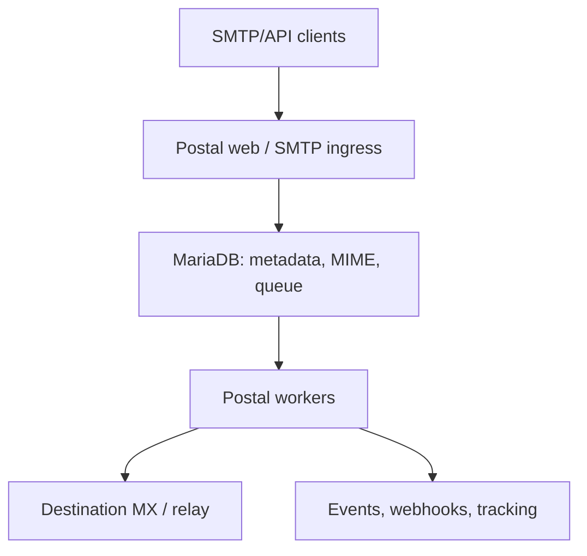

# Postal performance optimization guide: methodology and roadmap

## Purpose of this document

This document records the original requirements, the confirmed characteristics of Postal, the rules for load testing and the recommended optimisation sequence. It should be maintained alongside the code and updated after every confirmed measurement or architectural decision.

The document is not a promise of any particular level of performance. Any claim about a bottleneck or a gain must be backed by a reproducible test.

If you run Postal in production and want to apply it to your installation, start from [Questions that still have to be answered](#questions-that-still-have-to-be-answered): it is the discovery checklist for any Postal performance engagement. To have it applied to your installation, [contact me on LinkedIn](https://www.linkedin.com/in/victor-trapenok/).

## Core engineering rules

1. Count load in **recipients**, not only in SMTP sessions, API requests or campaign messages.
2. Do not optimise based on assumptions: first reproduce the baseline, then profile.
3. Change one significant variable per experiment.
4. Compare builds under identical CPU/RAM limits, data and configuration.
5. Do not treat the speed of a local SMTP sink as the speed of real internet delivery.
6. Any optimisation must preserve state tracking, retries, bounces and error reasons.
7. Performance without correctness, backpressure and a controlled rollback does not count as a result.
8. Preserve compatibility with the existing Postal fork first; replace components gradually.
9. Do not port the Ruby code to another language wholesale without proving that this particular path is what limits performance.
10. Measure not only throughput but also the cost of processing one million recipients.

## Known requirements and constraints

The project started from a brief for a production Postal installation. Its points are treated as requirements or input data, not as the results of independent measurement:

- The system is used for high-volume promotional campaigns.
- A full multi-tenant model for the new data plane is not required.
- The state of every recipient must be stored: sent, not sent, deferred, finally rejected, and the reason.
- IP mapping, IP pools/rotation and the creation of SMTP servers are critically important features.
- The existing product is a modified Postal fork with additional features.
- The current architecture scales predominantly vertically.
- The speed of the Ruby workers is named as the main suspected problem; the role of MariaDB has not been proven yet.
- A minimum of 5 million sends per day is required, with room for further growth.
- Go is ruled out. Ruby, Rust or C++ are acceptable for new components.
- It is desirable to keep the existing Postal and replace bottleneck components on top of it.
- Infrastructure cost must become a separate optimisation KPI.

## Contradictions and unknown data

The following questions must be resolved before the production SLO is pinned down:

- The brief quotes different current limits: "several million, but fewer than 5 million" and "no more than 1 million in 24 hours".
- It is not defined whether these numbers are messages, unique MIME objects or recipients.
- The duration of the sending window is unknown. Five million per day and five million in two hours are different problems.
- It is unknown where the limit was measured: Postal ingress, queue growth, connection attempts, or confirmed responses from remote MX hosts.
- The current topology, the MariaDB settings, the number of workers, the sending IPs and the actual monthly spend are unknown.
- The diff of the production fork against upstream Postal is unknown.
- A previous implementation in Go reached 5 million but was rejected because of other problems. Its code or a postmortem is needed before a new implementation.
- The feature mix, the retention and the volume of stored history are not defined.

Do not start a major replacement of the worker before at least partial answers to these questions are obtained.

## The scale of the target load

Five million recipients correspond to the following minimum average rates:

| Sending window |     Average rate |
| -------------: | ---------------: |
|       24 hours |  58 recipients/s |
|        8 hours | 174 recipients/s |
|        4 hours | 347 recipients/s |
|        2 hours | 694 recipients/s |
|         1 hour | 1,389 recipients/s |

This is the arithmetic mean only. A real system must withstand an agreed burst, retries and backlog drain. The design target cannot be derived from `5M / 24h` alone.

At an average MIME of 100 KB, five million separate copies mean about 500 GB of raw data per day before accounting for indexes, deliveries, replication and backups. Retention and the MIME storage model affect the architecture no less than CPU does.

## Measured findings on the 2-vCPU bench

These are results, not hypotheses. Profile: MIME 100 KB multipart, 1 recipient per message,
1000 destination domains, no retries, no tracking or webhooks, upstream Postal 3.3.7.

**Ingress and draining are limited by entirely different things, and mixing them hides both.**

| What | Rate | Limiter |
|---|---|---|
| Ingress, 1 web process | ~28/s | one core: MRI's GVL, a single Puma process |
| Ingress, 2 web processes | 56.7/s | scales by processes, ×1.98 |
| Draining, instant sink | 48.5/s | worker CPU |
| Draining, 75 ms sink delay | 7.1/s | **waiting on the network, CPU idle at 20 %** |
| Draining, delay + concurrency 32 | 51.3/s | approaching the machine's CPU ceiling |

Three conclusions that change the optimisation priorities:

1. **Ingress scales by processes, not threads.** The GVL prevents a single Puma process from
   doing compute work on more than one core, so adding cores to one process achieves nothing.
   Measured: 92.5 % under a 1.0 CPU limit, and ×1.98 from a second replica.
2. **Draining is not a compute task.** Its ceiling equals concurrency divided by the delivery
   latency. With a realistic sink delay the worker spends about 90 % of its time waiting, and
   its CPU sits at a fifth of the limit. Adding cores or nodes in that state changes almost
   nothing — raising the number of concurrent sessions does.
3. **Concurrency scales almost linearly**: eight times the concurrency gave 7.2 times the rate,
   reaching 51.3 recipients/s — 4.43M messages per day — on two cores. Whatever ceiling a
   production system reports at 1M/day, it is not a property of Postal at this scale.

A sink that answers instantly overstates draining roughly sevenfold. Any figure obtained
without a sink delay is an upper bound and must not be quoted as a production forecast.

The cost per message on clean runs: **25 ms of CPU for ingress including the DB, 32–35 ms for
draining**. At 58 recipients/s that is about 3.5 cores of continuous load — the sizing is
driven by required concurrency and by storage, not by processor power.

## Upstream Postal: confirmed structure

For Postal 3.x the runtime consists of three main processes:

- `postal web-server` — the Web UI and the HTTP API;
- `postal smtp-server` — SMTP ingress;
- `postal worker` — background jobs and delivery.

The `cron` and `requeuer` commands, as well as the RabbitMQ dependency, were removed in Postal 3.0. The queue and the coordination of background processing live in MariaDB.



Postal allows running several web, SMTP and worker instances. However, they use shared main/message databases, so adding processes does not guarantee linear scaling.

## Confirmed candidate bottlenecks

### 1. The synchronous SMTP acceptance path

The SMTP server stores every message and enqueues it before answering `250 OK`. The speed and latency of MariaDB directly affect SMTP reception.

Consequences:

- the ingress benchmark must measure the latency to `250` separately;
- increasing the number of SMTP replicas can only help up to the saturation of the shared DB;
- large messages and slow storage can delay other operations;
- before changing ingress, measure CPU, allocation rate, DB latency and the size of `DATA` held in memory.

### 2. A separate message per recipient

The HTTP/SMTP path creates a separate message for each recipient. When each message is stored, the raw headers/body, metadata, statistics and a queue entry are stored separately.

Consequences:

- a message to 50 recipients cannot be counted as one unit of load;
- the raw MIME may be duplicated many times over;
- the optimal future model is one immutable MIME object plus separate recipient envelopes;
- migrating to this model affects the UI, tracking, retention and search, so it must be done through a compatible adapter.

### 3. The DB-backed queue

The worker looks for messages by `ip_address_id`, the lock fields and `retry_after`, locks a row via `UPDATE ... LIMIT 1`, and can then add up to 100 messages with the same `batch_key`.

In the upstream schema the `queued_messages` table has separate indexes only on:

- `domain`;
- `message_id`;
- `server_id`.

Meanwhile the hot queries also use:

- `ip_address_id`;
- `locked_by`;
- `locked_at`;
- `retry_after`;
- `batch_key`.

This is a hypothesis about an inefficient query plan, not permission to immediately add an arbitrary index. Real `EXPLAIN/ANALYZE`, a slow query log, lock waits and tests at a production-like queue size are required first. The indexes may already have been changed in the production fork.

### 4. Hot statistics writes

When a message is created, message statistics and global totals are updated. Under high concurrency such counters can create row-lock contention and additional write amplification.

A candidate change: write immutable delivery events and compute the aggregates asynchronously and idempotently. Statistics cannot simply be deleted if the product's UI or reports depend on them.

### 5. The sending IP is bound to the worker host

The worker obtains the list of IPs of the OS's local interfaces and selects messages with no specific IP, or with an `ip_address_id` present on the current host.

Consequences:

- the scheduler must know on which node a sending IP is actually available;
- misplacing a worker leaves part of the queue with no executor;
- containers may require host networking or explicit address assignment;
- sending IP failover must include moving the IP on the network, routing and updating the scheduler state;
- IP rotation must not be implemented as a random choice of address, without regard to reputation and throttling.

### 6. DB and worker configuration

Upstream supports separate `main_db` and `message_db`. By default the worker uses two threads, and the main DB pool has a small default. These values are a starting point, not a production recommendation.

Increasing worker threads must be matched against:

- the DB pool size;
- the number of DB connections;
- row locks;
- the CPU of the Ruby processes;
- the concurrency of remote SMTP connections;
- the memory used by in-flight MIME.

Do not launch thousands of worker threads simply because the server has many CPUs.

## Study the production fork first

Before the first optimisation, capture the following artifacts:

1. The exact upstream base commit.
2. The full diff of the fork.
3. A list of modified DB migrations and indexes.
4. Changes to queue claiming, batching, retries and statistics.
5. The implementation of IP mapping and SMTP server creation.
6. The custom features and their use in production.
7. The current Docker images, configuration and startup parameters.
8. The existing metrics, dashboards and incidents.
9. The code and postmortem of the previous Go prototype.

Pay particular attention to changes that may have broken batching, connection reuse or the locality of the sending IP. Upstream Postal must not be treated as an accurate reflection of a production fork.

## Terms and units of measurement

All reports must state explicitly:

- `messages` — unique logical letters/MIME;
- `recipients` — individual addressees and their delivery state;
- `accepted` — Postal answered with an SMTP `250` or a successful HTTP response;
- `attempted` — the worker started an SMTP delivery attempt;
- `delivered` — the next SMTP server answered with a success code;
- `deferred` — a temporary error, a retry is expected;
- `failed` — a final error;
- `inbox placement` — the message actually landed in the inbox, which is not equivalent to an SMTP `250`.

The main throughput metric of the data plane is `recipients/s`.

## Mandatory benchmark indicators

### Performance

- maximum sustained accepted recipients/s;
- maximum sustained delivered-to-sink recipients/s;
- p50/p95/p99 latency to the SMTP `250` or HTTP response;
- p50/p95/p99 queue latency;
- backlog growth rate;
- drain time after a burst;
- delivery attempts/s and the retry rate.

### Efficiency

- CPU-seconds per 1 million recipients;
- RAM high-water mark;
- DB queries and DB time per recipient;
- DB rows written per recipient;
- disk bytes/IOPS per recipient;
- network bytes per recipient;
- infrastructure cost per 1 million recipients.

### Correctness

- lost messages;
- unexpected duplicates;
- invalid state transitions;
- a mismatch between accepted/delivered/failed/queued;
- an incorrect sending IP;
- lost or repeated webhooks;
- incorrect retry intervals.

The basic reconciliation invariant after a full drain:

```text
accepted_recipients = delivered + terminal_failed + suppressed + cancelled
```

While the test is running:

```text
accepted_recipients = delivered + terminal_failed + suppressed + cancelled + queued + in_flight
```

Every exception must be explained and reflected in the report.

## Separate measurement of ingress and queue draining

A combined run yields a single number that mixes two different quantities.
Ingress and delivery compete for the same cores and the same DB, while the queue between them
acts as a buffer: while it grows, ingress accepts faster than delivery manages
to hand off, and dividing what was accepted by the window length passes a backlog off as completed work.

An example from the first run on the bench: 8984 recipients accepted over a 180 s window, i.e.
49.9 rcpt/s of ingress, but the queue grew to 5701 rows and took a further 231 s to drain
after the load stopped. The sustained figure is 8984 / (180 + 231) =
**21.9 rcpt/s**, i.e. less than half. The first number must not be published as
throughput.

Three mandatory rules follow:

1. **The headline metric of a combined run is sustained
   throughput**: what was delivered over the whole time, including the drain. The ingress rate
   is quoted alongside it, and the difference between them shows how far the run leaned
   on the queue.
2. **Ingress is measured with the workers stopped** (`playbooks/ingress.yml`).
   Then the queue only grows, ingress does not compete with draining, and the growth of the
   queue must match what was accepted — a built-in reconciliation.
3. **Draining is measured on a pre-filled queue with ingress silent**
   (`playbooks/drain.yml`). The denominator of the rate is known exactly rather than being derived
   from the ingress rate.

The queue is filled the normal way — through the API with the workers stopped.
Raw SQL would have to reproduce by hand a row in `messages`, two
longblob rows of the per-day raw table and a queue row with all its associations,
and any inaccuracy there would look like a measurement result.

The queue length and the domain cardinality are the main multipliers of the cost of draining,
because neither of the two hot worker queries is covered by an index
(the mechanics are analysed in [docs/postal-internals.md](postal-internals.md)).
Hence a series of lengths is measured rather than a single point, and the queue composition
is measured separately: the share of rows with `retry_after` in the future reproduces the
degeneration at which the claim query stops being cheap.

## The limits of what a weak bench can answer

Weak hardware is not suitable for every question, and the two must not be confused.

**The relative question** — "is build B faster than build A?" — can be answered on weak
hardware if the comparison protocol is followed. This is the project's main work.

**The absolute question** — "will we withstand 5 million per day?" — cannot be answered on weak
hardware under any protocol.

The key technique: on weak hardware you measure not the ceiling but the **cost of a unit of
work**. A ceiling in rcpt/s does not transfer between different hardware; cost transfers
almost linearly:

- CPU-seconds per 1000 recipients, broken down by container;
- `SUM_ROWS_EXAMINED / COUNT_STAR` for the digest of the hot queries — direct
  falsifiable evidence of a full scan;
- SQL queries, rows written and bytes per recipient;
- Ruby allocations and GC time per recipient.

The second rule: **work below the overload point**, at 50–70 % of the discovered
limit. Under overload, latency is determined by the queue rather than by the code, and builds
become indistinguishable.

What is **impossible** to check on a weak bench:

| Not possible | Why |
|---|---|
| The absolute ceiling and the 5M/day target | 58 rcpt/s on 2 vCPU is already past the overload point |
| `scaling_efficiency(N)` | 1/2/4 workers share the same cores — the curve measures the exhaustion of cores, not the scalability of the architecture |
| Row-lock contention at realistic parallelism | The global `statistics` row throttles at dozens of concurrent transactions; at concurrency 2 there is no such parallelism |
| Behaviour under buffer pool misses | The production "data volume / memory" ratio cannot be reproduced |
| Disk latency | Written bytes are measurable, but the fsync latency of shared NVMe storage does not transfer |
| The p99 tail | Under overload it is determined by the queue, not by the build |
| The network limit | At 58 rcpt/s × 100 KB that is 46 Mbit/s and goes unnoticed; at 1389 rcpt/s it is 1.1 Gbit/s |
| The credibility of absolute numbers on shared vCPU | Steal time is not measured: `docker stats` does not report it |

The last one is partly curable: alternating `baseline → candidate → baseline`
and taking the median of five repeats subtracts the neighbours' noise from the **relative** comparison.
It does not rescue absolute numbers, and those require guaranteed cores
rather than a larger number of them.

## The correct test environment

The infrastructure is described separately in [bench-requirements.md](bench-requirements.md). The main rules:

- place the load generator separately from the SUT for final measurements;
- use a real Postfix with a queue and a `discard` transport for the happy path;
- deploy several Postfix instances only after proving that one has become the bottleneck;
- run a direct calibration of the generator and Postfix before every Postal test;
- the capacity of the auxiliary chain must be at least twice that of Postal;
- use our own DNS and `.test` domains;
- forbid outbound TCP/25 to all addresses except the test sinks;
- store the image digest, the commit SHA, the inventory, the resource limits and the seed workload together with the result.

Postfix with discard exercises a real SMTP handshake and queue acceptance, but it does not model the behaviour of the internet. Retries need an additional fault-injection SMTP endpoint with profiles for:

- success `250`;
- temporary `421/450/451`;
- permanent `550/551/553`;
- a slow banner/DATA response;
- connection reset and timeout;
- TLS success/failure;
- an ambiguous disconnect after DATA has been accepted.

## The build comparison protocol

For each candidate:

1. Restore an identical DB and queue state.
2. Verify the healthchecks.
3. Run a direct sink calibration.
4. Run a 3-minute warm-up.
5. Run at least 10–15 minutes of steady load.
6. Stop ingress and measure the drain.
7. Run the reconciliation.
8. Repeat the test at least five times.
9. Use the median and show the spread.
10. Run `baseline → candidate → baseline` series in order to detect host drift.

The throughput improvement formula:

```text
improvement_percent = (candidate_throughput / baseline_throughput - 1) * 100
```

The scaling efficiency formula:

```text
scaling_efficiency(N) = throughput(N) / (N * throughput(1)) * 100
```

Build two independent curves:

- identical resources, different builds — code efficiency;
- 1/2/4/8 workers or resource units — scaling potential.

On a shared VPS, do not declare a small gain a win if it is comparable to the run-to-run spread.

Weak, fixed hardware is suitable for comparing relative gains. Final conclusions about horizontal scaling must be repeated on several isolated nodes with guaranteed CPUs and a fixed network.

## The workload matrix

The minimum matrix must include:

- MIME: 10 KB, 100 KB, 1 MB; 10 MB only in a short test;
- recipients/message: 1, 10 and 50;
- destination distribution: a single domain, several large domains, thousands of domains;
- SMTP response: fast success, slow success, temporary fail, permanent fail;
- tracking: off/on;
- DKIM: off/on;
- webhooks: off/on and a slow endpoint;
- spam/virus inspection: according to the production feature mix;
- burst, steady state and recovery;
- an empty, a medium and a large queue.

The primary benchmark profile must be pinned and must not change between commits. Additional profiles must not replace the primary one.

## Diagnostic tooling

### Ruby/Postal

- CPU flamegraphs and a sampling profiler;
- allocation/GC statistics;
- RSS per process;
- worker job execution time;
- SMTP command latency;
- the number of active SMTP connections;
- Postal's existing Prometheus metrics.

### MariaDB

- the slow query log and `performance_schema`;
- `EXPLAIN` for the queue claim, batching and message lookup;
- query latency and rows examined;
- row lock waits/deadlocks;
- the buffer pool hit rate;
- the redo/flush rate;
- active connections and pool wait;
- disk latency, IOPS and fsync;
- the size of the tables and indexes.

### OS and network

- CPU utilization and steal time;
- context switches;
- memory pressure/page faults;
- disk latency/queue depth;
- TCP connections, retransmits and ephemeral ports;
- DNS latency/cache hits;
- network throughput per node.

## The optimisation sequence

### Stage 0. A reproducible baseline

- Deploy upstream and the production fork on an identical bench.
- Reproduce the reported limit.
- Separate ingress throughput from queue drain throughput.
- Find the first saturated resource.
- Record the baseline report in the repository / CI artifacts.

Move on only if the test repeats with an acceptable spread.

### Stage 1. Low-risk changes to the existing Postal

Verify one at a time:

- query plans and justified composite indexes;
- the balance between the DB pool and worker threads;
- the number of Ruby worker processes;
- the MariaDB buffer pool, the redo log and NVMe latency;
- separating the main DB and the message DB;
- batching by destination domain;
- eliminating network/DNS/IPv6 timeouts;
- disabling genuinely unused feature paths;
- reducing synchronous statistics without losing data.

Do not expect a simple index to necessarily give a tenfold gain: the client may already have performed the basic optimisations.

### Stage 2. Reducing DB write amplification

Candidates:

- append-only delivery events instead of synchronously updating aggregates;
- asynchronous counters and analytics;
- bulk writes;
- a separate webhook queue;
- a more efficient queue claim;
- table partitioning/retention;
- avoiding repeated MIME parsing.

Every change must have a migration, a rollback and a reconciliation job.

### Stage 3. A Rust outbound worker as the first replaceable component

The preferred first Rust PoC is not a full analogue of Postal but a compatible outbound delivery worker.

It must implement:

- receiving a job through a versioned adapter;
- the recipient state machine;
- DNS/MX resolution and a cache;
- SMTP/TLS delivery;
- connection reuse per destination;
- per-domain and per-IP concurrency/rate limits;
- retry scheduling with jitter;
- selection of the sending IP and the HELO identity;
- recording the delivery result and the diagnostic reason;
- idempotency and attempt IDs;
- metrics, structured logs and graceful shutdown;
- backpressure on DB/queue/MX problems.

Run it first in shadow/read-only mode, or route a small isolated shard to it. The Ruby worker must remain available for rollback.

### Stage 4. A new MIME storage model

The target model:

```text
MessageContent (one immutable MIME blob)
    ├── RecipientEnvelope A
    ├── RecipientEnvelope B
    └── RecipientEnvelope C
```

Requirements:

- streaming upload instead of a full buffer in memory;
- a content ID and integrity checking;
- one MIME blob per logical message;
- separate recipient/delivery states;
- retention and safe garbage collection;
- support for DKIM/tracking transformations;
- UI/API compatibility through an adapter;
- object storage only after latency and cost have been measured.

### Stage 5. Moving out the durable queue and the retry scheduler

Do not add Kafka, NATS, RabbitMQ or any other system just for the sake of the word "scaling". The decision is taken after it has been confirmed that the MariaDB queue remains the bottleneck after the cheaper changes.

The new queue must provide:

- durable at-least-once processing;
- a partition key by destination domain and/or sending IP;
- deferred retries;
- a visibility timeout / lease recovery;
- controlled redelivery;
- backpressure and quotas;
- replay/audit;
- independent queues for delivery, inbound and webhooks.

### Stage 6. Stateless ingress and horizontal scaling

Once MIME storage and the durable queue have been separated out, SMTP/API ingress can become stateless:

- streaming writes;
- admission control;
- an idempotency key for the HTTP API;
- bounded concurrency;
- fast durable acknowledgement;
- independent scaling of web and SMTP ingress.

## Language choice

### Rust — the primary choice for the new data plane

Advantages over C++:

- performance close to C++ without a garbage collector;
- memory safety without manual management of memory lifetimes;
- protection from a significant share of data races at the type level;
- a strong ownership model for in-flight message state;
- a modern async I/O ecosystem;
- convenient static binaries and containerisation;
- pattern matching and strict enums for the SMTP/delivery state machine;
- a built-in culture of testing, fuzzing and safe dependency management;
- usually a lower cost of maintaining a network service over many years than new C++ code;
- the technology's usefulness for the future job market.

Rust risks:

- the learning curve and a slower first implementation;
- long compile times;
- the email/SMTP libraries need to be assessed with a prototype;
- a weak architecture cannot be compensated for by the choice of language alone.

### C++

Use it if a specific mature library or existing code offers a measurable advantage. For a new asynchronous SMTP worker, Rust is preferable because of safety and maintainability.

### Ruby and TypeScript

- Keep Ruby for the existing control plane, the UI and compatibility logic until they are proven to be a bottleneck.
- TypeScript is suitable for CI orchestration, the benchmark controller, reports and internal APIs.
- TypeScript is not the preferred language for the hottest delivery loop itself.
- Do not use Go, which is ruled out, but do study the reasons the previous Go prototype was rejected.

## IP mapping and the creation of SMTP servers

Document the current chain before changing the workers:

```text
campaign/client/domain
  → sending pool
  → sending IP
  → worker host/network interface
  → HELO hostname + PTR/rDNS
  → DKIM domain + return path
  → destination-domain throttling
```

The following must be determined:

- whether the mapping is static, random, weighted or reputation-aware;
- how IPs are pinned to servers and containers;
- how SMTP server configurations are created and removed;
- what happens when a worker host becomes unavailable;
- whether the queue can be safely redistributed to another IP;
- how warming, complaint rate, bounce rate and provider limits are accounted for;
- where quotas and throttling state are stored;
- how consistency is ensured with several scheduler replicas.

IP rotation does not improve deliverability by itself. Changing IPs too aggressively can damage reputation and lead to blocks.

## Delivery state and guarantees

The recommended state machine:

```text
accepted → queued → leased → attempting
                         ├── delivered
                         ├── deferred → queued
                         └── terminal_failed
```

SMTP does not allow exactly-once to be guaranteed across all network failures. For example, a connection may drop after the remote server has accepted the message but before the sender has recorded the response.

Therefore the following are required:

- at-least-once semantics;
- a unique message/recipient ID;
- a unique attempt ID;
- idempotent internal events and webhooks;
- a detector of unexpected duplicates;
- an audit trail of all transitions;
- lease recovery after a worker crash;
- a bounded number of retries and a dead-letter/terminal state.

## Deliverability separately from throughput

A local Postfix shows the technical throughput, but production delivery depends on:

- the latency and throttling of Gmail/Microsoft/Yahoo/corporate MX hosts;
- IP/domain reputation and warming;
- PTR/rDNS, SPF, DKIM and DMARC;
- complaint/bounce suppression;
- per-domain connection and message limits;
- DNS failures and IPv4/IPv6 routing;
- message size;
- retries and greylisting.

Outbound MX delivery normally uses TCP/25. Ports 465/587/2525 mostly relate to submission or relay and do not replace access to the destination MX:25. Provider restrictions must be verified before production deployment.

## Several independent Postal installations

Several fully isolated Postal installations with separate DBs really can give an almost linear gain if the workload can be partitioned statically. This option should be kept as a fallback and as a control experiment.

Potential sharding keys:

- campaign;
- client/account;
- sending domain;
- IP pool;
- destination-domain partitions.

Limitations of the approach:

- a global router is needed;
- failover and rebalancing become more complex;
- suppressions/unsubscribes may require shared consistency;
- statistics, search, webhooks and audit become distributed;
- duplicates are possible when moving a shard;
- some capacity sits idle because campaigns are uneven;
- upgrading the modified fork has to be done on every shard;
- IP pools and worker placement still require centralised management.

For the current campaign-only use case this option may turn out to be cheaper than a full rewrite. It should be compared with the Rust data plane on cost and operational complexity.

## Architectural principles of the target solution

- Separate the Postal control plane from the high-load data plane.
- Make ingress stateless after a durable write.
- Store the MIME once, keep state per recipient.
- Separate the delivery queue, the retry scheduler, inbound and webhooks.
- Build partitioning around the destination domain and the sending IP.
- Reuse SMTP connections where the receiving side allows it.
- Apply per-domain/per-IP backpressure.
- Compute statistics asynchronously from events.
- Do not use globally hot counters in the transaction path.
- Have versioned contracts between Postal and the new components.
- Support canaries, feature flags and fast rollback.
- Design operations to be idempotent.
- Do not store unbounded history without a retention policy.

## Security and operational constraints

- Keep DKIM keys, SMTP credentials and DB passwords outside the Git repository.
- Do not write raw MIME, addresses or credentials into ordinary application logs.
- Separate the DB users of the control plane, the delivery workers and analytics by the minimum necessary privileges.
- Sign/pin Docker images by digest and preserve the build provenance.
- Restrict the outbound network destinations of every component.
- The test environment must exclude sending to real MX hosts, physically or through firewall rules.
- Any debug/trace mode must have a limited lifetime and a limited retention volume.
- Verify backup/restore and disaster recovery separately from the performance benchmark.

## A safe rollout strategy

1. **Observe:** add metrics without changing behaviour.
2. **Shadow:** the new component reads a copy of the jobs but does not send.
3. **Synthetic shard:** sending only to an internal Postfix.
4. **Canary:** a small production shard with a separate IP/domain.
5. **Compare:** reconciliation of the old and the new path.
6. **Ramp:** 1% → 5% → 20% → 50% → 100% while the SLO is met.
7. **Rollback:** the ability to return a shard to the Ruby workers immediately.

The queue, the storage, the SMTP worker and the schema must not be changed at the same time: on degradation it would be impossible to localise the cause.

## Cost model

Compute for every build:

```text
cost_per_million =
  compute + database + storage + traffic + observability + operational overhead
```

The minimum report indicators:

- recipients/core-hour;
- recipients/GB RAM-hour;
- DB I/O per million;
- stored GB per million;
- outbound GB per million;
- infrastructure cost per million;
- engineering/operational complexity as a qualitative assessment.

An optimisation is considered useful if it increases throughput, reduces unit cost, or improves latency/reliability without an unacceptable increase in complexity.

## What not to do

- Start with a full rewrite of Postal.
- Rewrite the Web UI / admin panel for the sake of delivery speed.
- Count one API request as one message regardless of the number of recipients.
- Use a success-only SMTP sink.
- Test against real external addressees.
- Compare builds on different server types.
- Pick the best single run instead of the median.
- Increase the number of workers without watching DB locks and the pool.
- Add indexes without checking the write cost and the query plan.
- Add a distributed queue before the need has been proven.
- Lose the history of delivery attempts for the sake of throughput.
- Perform random IP rotation without a reputation model.
- Declare a `250 Accepted` to be inbox placement.

## Questions that still have to be answered

### Load and SLO

- Are the 5 million messages or recipients?
- Over what window must this volume be sent?
- What are the average, p95 and peak over 1-second, 1-minute and 5-minute intervals?
- What backlog and drain time are acceptable?
- What are the p95/p99 acceptance and delivery latencies?
- What are the average/p95/p99 MIME size and recipients/message?

### The current system

- Can we get the fork, the commit SHA and the diff against upstream?
- What is the exact layout of servers, DBs, workers and IP pools?
- Which queries/processes saturate the CPU, DB, disk or network?
- What are the queue length, the queue latency and the retry/bounce rate?
- Which optimisations have already been made?
- What does the current limit of 1 million mean and where was it measured?

The following four questions became the most important ones after the concurrency series,
because the measurements point at configuration rather than at Ruby:

- **What are `WORKER_THREADS` and the number of worker replicas?** The default is 2 threads.
  At a realistic delivery latency that alone caps the rate near 7 recipients/s per two
  replicas — roughly 0.6M per day, the same order as the reported ceiling.
- **Which upstream version is the fork based on?** A configurable thread count in the worker
  appeared only in Postal 3.3.0 (March 2024). A fork from an earlier base may have the
  concurrency fixed in code, which would explain a ceiling that no amount of hardware moves.
- **What is `MAIN_DB_POOL_SIZE` and MariaDB's `max_connections`?** The pool default is 5 and
  becomes the limiter before the threads do; a pool smaller than the thread count silently
  serialises delivery.
- **What is the average duration of one delivery, and what is the worker's CPU utilisation?**
  If CPU sits low while the queue grows, the money is being spent on processors that wait on
  the network, and more servers will not help.

### The previous Go prototype

- Where is the code?
- How was the result of 5 million confirmed?
- Which problems exactly led to it being rejected?
- Were there losses, duplicates, or problems with tracking, IP mapping, retries or deliverability?
- Can its benchmark be repeated on the new bench?

### Features

- Which custom features are actually used?
- Are inbound routes, spam/virus scanning, tracking and webhooks needed?
- How do global suppressions/unsubscribes work?
- What retention is needed for MIME, events and logs?
- How is searching the history supposed to work?

### IP and SMTP

- How many sending IPs are there and on which nodes do they reside?
- How does the campaign/domain → IP pool mapping work?
- How are SMTP servers and credentials created?
- What are the warming, quota and failover rules?
- Which cloud/hosting providers allow the required outbound TCP/25?

## Definition of Done for every optimisation

A change can only be accepted if:

- there is a benchmark before and after;
- the resources and the workload are identical;
- the result was repeated at least five times;
- the percentage gain and the spread are given;
- the queue does not grow under steady load;
- the reconciliation found no losses;
- duplicates do not exceed the agreed limit;
- retries, bounces, tracking and webhooks preserved their contract;
- the new bottleneck is shown;
- there is a migration and rollback plan;
- this document, the ADR and the benchmark report have been updated.

## Recommended ADR structure

Create a separate Architecture Decision Record for every significant decision:

```markdown
# ADR-NNN: Title of the decision

## Context

Which measured bottleneck is being addressed.

## Baseline

The commit, image digest, workload, resources and results.

## Decision

Which change was adopted.

## Alternatives

Which options were considered and why they were rejected.

## Consequences

Performance, correctness, cost, migration and rollback.

## Verification

Links to the benchmark artifacts and the reconciliation report.
```

## Entry points in upstream Postal

The links below point at `main` for ease of navigation. The benchmark report must record the exact commit SHA and, where possible, replace the links with pinned revisions.

- Runtime commands: [`bin/postal`](https://github.com/postalserver/postal/blob/main/bin/postal)
- SMTP persistence before `250`: [`app/lib/smtp_server/client.rb`](https://github.com/postalserver/postal/blob/main/app/lib/smtp_server/client.rb)
- Per-recipient message creation: [`app/models/outgoing_message_prototype.rb`](https://github.com/postalserver/postal/blob/main/app/models/outgoing_message_prototype.rb)
- Raw MIME, statistics and queue writes: [`lib/postal/message_db/message.rb`](https://github.com/postalserver/postal/blob/main/lib/postal/message_db/message.rb)
- Queue schema/indexes: [`db/schema.rb`](https://github.com/postalserver/postal/blob/main/db/schema.rb)
- Queue locking and local sending IP discovery: [`app/lib/worker/jobs/process_queued_messages_job.rb`](https://github.com/postalserver/postal/blob/main/app/lib/worker/jobs/process_queued_messages_job.rb)
- Destination batching: [`app/models/queued_message.rb`](https://github.com/postalserver/postal/blob/main/app/models/queued_message.rb)
- Worker queue-latency metric: [`app/lib/worker/process.rb`](https://github.com/postalserver/postal/blob/main/app/lib/worker/process.rb)
- Main/message DB and worker configuration: [`doc/config/yaml.yml`](https://github.com/postalserver/postal/blob/main/doc/config/yaml.yml)
- Postal 3 changes: [`CHANGELOG.md`](https://github.com/postalserver/postal/blob/main/CHANGELOG.md)

## The project work plan

| # | Step | Status |
|---|---|---|
| 1 | Deploy a reproducible test environment | done — [running.md](running.md) |
| 2 | Automate its deployment through the Ansible inventory | done — `inventories/single-host`, `inventories/distributed` |
| 3 | Measure upstream Postal | done — [RESULTS.md](../RESULTS.md); measuring a production fork needs access to it |
| 4 | A fork and CI/CD that builds, tests and publishes every candidate | done — [custom-builds.md](custom-builds.md) |
| 5 | Small, confirmed optimisations of the existing code | first change done — [optimisations.md](optimisations.md); its gain needs production-size hardware |
| 6 | A compatible worker with PoC optimisations for the first proven bottleneck | next phase — [roadmap.md](../roadmap.md) |
| 7 | Replace the queue/storage/ingress only where measurements and a safe migration path exist | next phase |

Steps 1–5 are the scope of this repository. Steps 6–7 depend on data only a production
installation can provide; the questions above are the checklist for collecting it.
